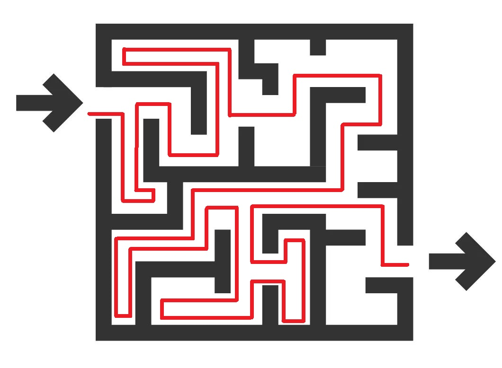
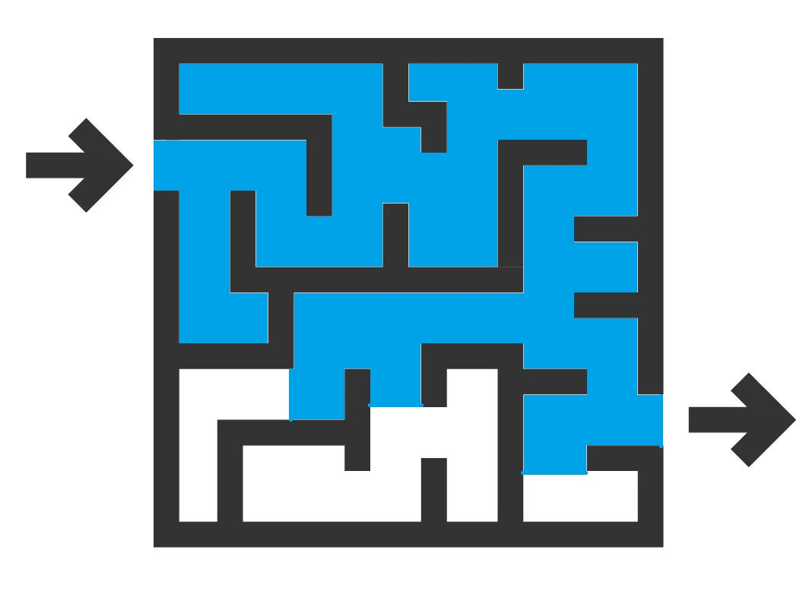

# 初识算法

算法（algotithm）顾名思义，就是计算的方法。    
计算机和编程语言只是解决问题的工具，而算法则是解决问题的方法。  
如果要使用计算机解决某个具体问题，我们需要对计算的步骤做出相应的描述，  
进而用特定的编程语言来实现。

对算法的研究主要是解决两个问题：“怎么算” 和 “怎样算更好”。

## 怎样计算

首先我们希望的是，对于任意一个突然摆在面前的问题，能给出一个可行的算法把结果算出来。  
这就是 “怎么算” 的问题。

在确定了可能的解的范围的情况下，一个自然的想法就是搜索，搜索的想法类似走迷宫：  
把所有可能的解（岔路口）都查一遍，从而把真正的解（出口）给找出来。


### 深度优先搜索

**深度优先搜索（Depth First Search，DFS）** 类似于一个对迷宫一无所知的人在走迷宫时会采用的方法：  
径直走下去，遇到岔路口选择一条岔路向前，走到死胡同的时候返回到之前走过的岔路口走其他岔路，  
直到走到出口或排除掉所有岔路。



深度优先搜索的 C 代码大致如下：

```c
void dfs(/* 当前状态 */){
	if(/*当前为终止状态（死胡同或出口）*/){
		/*更新解*/
		return;
	}
	while(/*扫描所有岔路*/) if(/*岔路可以走*/){
		//更新状态
		dfs(/*下一状态*/);
		//撤回到原状态
	}
}
```

### 广度优先搜索

**广度优先搜索（Breath First Search,BFS）** 类似于 “水走迷宫”：  
在入口处浇水，水流遇到岔路会分成多股同时走，最终总有一股水流能到终点



我们用一个队列来模拟“多股水流同时移动”的过程，大致的 C 代码如下：

```c
void bfs(){
	queue<type> q;
	q.push(/*初始状态*/);
	while(!q.empty()){
		type now=q.front();//取出时间最靠前的水流（now）
		q.pop();
		while(/*扫描所有岔路*/) if(/*岔路可以走*/){
			type nxt;
			/*nxt 即 now 的下一个状态*/
			q.push(now);
		}
	}
}
```

## 怎样算更好

虽然具有强大的计算能力，计算机的计算能力终究是有限的，  
具体表现在计算机有着有限的计算速度和内存空间。

在这两个因素的衡量下，同一问题的不同算法显然有优劣之分。例如，欲计算

$$1+2+3+\cdots+n$$

代入求根公式 $\dfrac{n(n+1)}{2}$ 计算显然比用循环直接计算要更优。

“怎样算更好” 就是研究如何用尽可能少的时间和空间解决给定的问题。

下面我们用排序，即 “将 $n$ 个数从小到大（或从大到小）排成一列” 为例，  
来具体讨论这个问题。

### 插入排序

如何将 $n$ 个数从小到大排成一列？一个自然的想法是，在前 $k\ (1\le k<n)$ 个数已经有序的情况下，    
将第 $k+1$ 个数插入到这 $k$ 个数中。这就是 **插入排序（Insertion Sort）**。

插入排序的 C 代码如下：
```c
void insertionSort(int a[],int n){//待排序的数为 a[1]~a[n]，从小到大排序
	for(int k=1;k<n;++k)
		for(int i=k;i>0&&a[i]>a[i+1];--i){
			int get=a[i];
			a[i]=a[i+1],a[i+1]=get;
		}
}
```

如何衡量插入排序的用时呢？我们注意到，插入排序总共要进行 $n-1$ 次插入，  
第 $k$ 次插入最多发生 $k$ 次交换，因此总的交换次数最多为

$$1+2+\cdots+(n-1)=\dfrac{n(n-1)}{2}$$

算法的运行时间是一个复杂的变量，与具体的硬件和编程语言均有关。  
但是，我们并不关心实际的运行时间，而只关心运行时间随数据规模 $n$ 的增长率。  
因此，我们称插入排序的 **时间复杂度** 为

$$\Omicron(n^2)$$

其意义是，在 $n$ 足够大时，插入排序的运行时间以二次函数的速度增长。

类似的，可以定义一个算法的 **空间复杂度**。显然插入排序的空间复杂度为

$$\Omicron(n)$$

### 归并排序

如何做到比 $\Omicron(n^2)$ 更快呢？我们在插入排序的基础上进一步思考这个问题。  

具体地，我们不是考虑将单个数逐个插入已经排好序的数组中，而是考虑将两个已经排好序的数组合并。  
显然这是容易实现的：将两个排好序的数组分别装入两个队列中，  
每次取出两个队列的队头中较小（或较大）的那一个，其 C 代码如下：

```c
int* merge(int *a,int n,int *b,int m){
	//将 a[0]~a[n-1],b[0]~b[m-1] 合并，均为从小到大排序
	int *out=(int*)malloc((n+m)*4);//答案数组
	int k=0,p=0,q=0;//队列的队头

	while(p<n&&q<m)
		if(a[p]<b[q]) out[k++]=a[p++];
		else out[k++]=b[q++];
	//两个队列均非空时，取出两个队列的队头中较小的那一个

	while(p<n) out[k++]=a[p++];
	while(q<m) out[k++]=b[q++];
	//两个队列中有一个为空的情况

	return out;
}
```
显然，合并操作 `merge` 的时间复杂度为 $\Omicron(n+m)$。


只有一个数的数组一定是有序的。我们将待排序的数组分成两半，两半分别排好序后，  
即可整体合并成一个排好序的数组。这就是 **归并排序（Merge Sort）**。  
在我们已经实现了合并操作的基础上，其 C 代码如下：

```c
void mergeSort(int *a,int n){
	if(n==1) return;
	int mid=n/2;//将数组分成两半
	mergeSort(a,mid),mergeSort(a+mid,n-mid);//两半分别排序
	int *b=merge(a,mid,a+mid,n-mid);//将两个数组合并
	for(int i=0;i<n;++i) a[i]=b[i];
	free(b);
}
```

归并排序的时间复杂度是多少呢？设归并排序的时间复杂度为 $T(n)$，则由排序过程得

$$T(n)=2T\left(\dfrac{n}{2}\right)+\Omicron(n)$$

设 $f_s=T(2^s)$，求解 $T(n)$ 等价于解递推式

$$f_s=2f_{s-1}+2^s$$

解得 $f_s=(f_0+s)2^s$。也就是说，归并排序的时间复杂度为

$$\Omicron(n\log n)$$

在计算机科学中 $\log n$ 一般指以 $2$ 为底的对数 $\log_2 n$。

## 如何更进一步的学习

以上只是对算法的一个初步介绍。算法的学习内容实际上远不止这些，  
例如搜索算法还有启发式搜索（A*）等，排序算法还有堆排序（Heap Sort），基数排序（Radix Sort）等。

你还可以在 [OI wiki](https://oi-wiki.org/) 作进一步的学习。