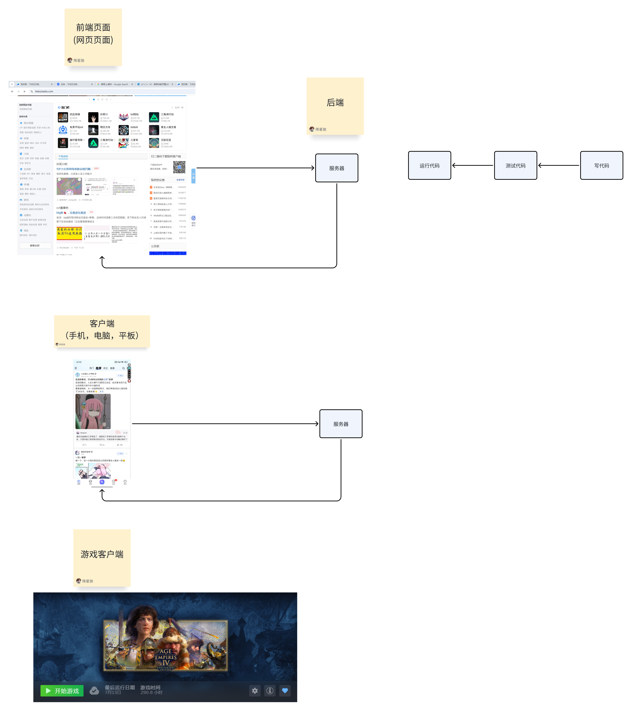

## 前言
> 想了很久也不知道怎么开笔，就先说说自己的事情吧，笔者是重庆人，生活在一个小县城，最早接触计算机是小学去黑网吧打生死狙击，初高中网吧都没去过。高考之后为什么选择这个专业呢？这里引用著名教师，我的 C++ 老师 的话："你们当时肯定都以为计算机专业是 '人少钱多速来' 吧。"

作为一个大学才接触计算机的小白，我对计算机基本没什么认知，属于是老师讲什么自己就往那方面去学习。当时计算机专业课只有《C++程序设计》和《计算机导论》，我也忘了导论课老师讲的怎么样了，但是这门课没怎么学好，后来上《计算机研讨课》才听说之前导论是这个老师讲的，后来换人了，我觉得这个老师真的是很有魅力且有大智慧的老师，说不定他讲这门课我能更快入门 CS，不过 **人最好不要美化自己没有走过的路**。C++ 老师和他讲授的《C++程序设计》真正启蒙了我大学时的计算机学习。

我记得作业最多的就是这门课，很多时候都是熬夜写，就算这样还是很多看不懂、做不完。当时还不懂 C++ 老师的良苦用心，觉得老师不讲基础、内容讲得快还布置很多编程作业超级逆天，还在群里调侃过老师。现在觉得老师的教学模式还是挺先进的，因为一个刚结束高中苦读三年的人似乎觉得玩才是最重要的事情，没有自驱力的时候确实需要老师的督促。

因为 C++ 老师是 ACM 负责人，所以大一时对计算机的认知只有写算法题，当时励志大二一定要加入到 ACM 训练中，还是因为机缘巧合下看 B站、Google 冲浪才慢慢了解到了一些别的东西，例如开源，open source。

不回忆了，现在开始讲这篇文章的目的：破除信息差。

不过我认为破除信息差是很难的，我也只能给你一点资源、一点建议，剩下的还是靠你自己去探索。

## 人生规划

首先确定你自己的人生规划，你打算读研究生还是本科就业。这个问题必须你自己提前解决，不是在你保研无望时选考研、考研失败才把就业当退路，我觉得那个时候你才开始学习就业需要的技术是来不及的。我明白现在的教育让很多人没有自己的想法，完全是做题家（当然我也是这样的），但我还是希望你想想读研究生能给你带来什么，是沉浸在学术氛围中勤勤恳恳做科研，还是被老师 push 当牛马，希望你拿到研究生证的时候不后悔自己的选择。

### 考研深造
如果打算考研，请移步 <a href="https://neuq-manual.vercel.app/get-started/%E7%94%B5%E5%AD%90%E4%BF%A1%E6%81%AF%E7%B1%BB-%E4%BF%9D%E7%A0%94/" target="_self">另一位学长写的保研规划</a>

### 本科直接就业

本人是坚定的本科就业党，原因如下：
1. 我认为要是真的想学技术的话本科时间完全够了（不过这里又得提到信息差，你得知道自己需要学什么，自己的目标工作需要你掌握哪些知识）
2. 看过这篇知乎高赞问答 [链接](https://www.zhihu.com/people/1596382847)（这篇文章修修改改感觉没有之前的味道了，果然大实话是不让人说的）、《优秀的绵羊》以及我在 NEUQ 受到的教育，我实在是对高等教育失望了。同时我不否定高等教育的存在是很好的，但是现在的计算机教育实在是太落后了，严重的校企分割。[NJU JYY 老师](https://www.zhihu.com/people/jiang-yan-yan-75)（我的 OS 网课老师）似乎在反抗，不知道他能否成功，我是很希望他成功拿下所谓的老教授们。

虽说是本科就业但我也不是让你大一开学就给出自己的规划，在大一是很难想清楚要升学还是就业的。大一主要就干一件事情，探索计算机世界，计算机世界真的很大，有太多方向，太多有意思的事情。无论对什么感兴趣，就去看，去了解，和前辈们聊一聊，看看经验贴。当然我觉得这个阶段可以先不考虑就业什么的，除非你下定了决心，毕业赚两年转行或者回老家，否则，我觉得关注就业，关注钱，关注方向未来，除了制造额外的焦虑以外没有任何实质性帮助。

如果你真的热爱，真的喜欢，你每年的能力增长速度是要比别人快的，只是一开始大家基础差不多，感受不太出来，但到五年后，十年后，你还保持着热爱，那么这就是一个指数级的事情，你大概会成为具体方向人才市场的香饽饽，那时候钱也好，机遇也罢，都会有的。再不济，你那个方向真的凉透了，实际上计算机的大部分技术也是换汤不换药的，没什么大问题。

### 就业方向
这里给出一个很简陋的就业方向

私企方向：
- 后端
- 前端
- 客户端
- 测试
- 运维
- 算法 / AI
- 基础架构
  - 车企
  - 手机厂商
  - 互联网的基础服务
- 外企

算法 >> 后端 > 基础架构 > 前端 > 客户端 > 测试 > 运维（仅代表个人粗鄙的观点，不同意自行 Google、BOSS）

---
创业方向：
- 独立开发（全栈）

-----
稳定方向：
- 国企
- 银行
- 公务员
----

以下为 AI 生成（善用工具）

#### 后端开发
**核心技能**：
- 编程语言：Java、Python、Go、C++ 等
- 框架：Spring Boot、Django、Gin 等
- 数据库：MySQL、PostgreSQL、MongoDB、Redis
- 消息队列：RabbitMQ、Kafka
- 微服务：Docker、Kubernetes、Service Mesh

**职业路径**：初级后端 → 高级后端 → 架构师 → 技术专家

#### 前端开发
**核心技能**：
- 基础：HTML、CSS、JavaScript
- 框架：React、Vue、Angular
- 构建工具：Webpack、Vite
- 移动端：React Native、Flutter
- 性能优化、用户体验设计

**职业路径**：前端工程师 → 高级前端 → 前端架构师 → 全栈工程师

#### 算法工程师
**核心技能**：
- 数学基础：线性代数、概率论、统计学
- 机器学习：sklearn、TensorFlow、PyTorch
- 深度学习：CNN、RNN、Transformer
- 计算机视觉、自然语言处理
- 大数据处理：Spark、Hadoop

**职业路径**：算法实习生 → 算法工程师 → 高级算法工程师 → 算法专家

#### 数据工程师
**核心技能**：
- 数据处理：Pandas、NumPy
- 大数据技术：Hadoop、Spark、Flink
- 数据仓库：Hive、ClickHouse
- 流处理：Kafka、Storm
- 云平台：AWS、阿里云、腾讯云

#### 运维/DevOps
**核心技能**：
- Linux 系统管理
- 容器化：Docker、Kubernetes
- 自动化部署：Jenkins、GitLab CI
- 监控：Prometheus、Grafana
- 云原生技术栈

#### 安全工程师
**核心技能**：
- 网络安全、Web 安全
- 渗透测试、漏洞分析
- 安全工具使用
- 安全防护体系设计

## 学习资源推荐

### 学习
1. [北大飞猪整理的学习文档](https://csdiy.wiki)，我觉得我们学校的教育存在的问题是很多老师讲的全是古早计算机的原理，对于实践、编程的练习太少了，同学们可以去做国外公开课 labs。
2. [电子书网站](https://z-library.sk/)，我大学四年的教材全是来自这里，不过你懂的，需要科学上网。
3. **在线课程**：Coursera、edX、中国大学 MOOC
4. **技术论坛**：V2ex、Stack Overflow、掘金，不过现在 AI 火了之后这些网站的 UV Unique Visitors 越来越低了，希望大家使用 AI 的同时不要丧失提问的能力和让自己变得只会复制粘贴答案，共勉。
5. 微信读书：学习的同时别忘了多看书让自己保持思考能力，这个思考能力就带点哲学味道了，思考自己的人生，不是思考类似并发编程能否数据一致的技术问题。

### 算法
1. **编程练习**：LeetCode、牛客网、CodeForces、洛谷
2. [算法可视化平台](https://www.cs.usfca.edu/~galles/visualization/Algorithms.html)，这是数据结构老师推给我们的，觉得挺好用的。

### 开源
1. [Github](https://github.com/)，很多开源项目的源代码都在 Github 上，可以学习别人的代码，也可以把自己的代码开源出去，让更多的人看到。
2. [中科院开源之夏 OSPP](https://summer-ospp.ac.cn/)，这是一个面向高校学生的暑期开源活动，可以参与开源项目提升自己的编程能力，同时也有机会获得奖学金和实习机会，我就是在这里挣了自己的第一桶金。
3. [Google Summer of Code](https://summerofcode.withgoogle.com/)，Google 的开源项目活动，这个算是 OSPP 的爸爸，我现在也参加了这个项目。

### 工具
1. [油猴脚本](https://greasyfork.org/zh-CN/scripts) 我写过一个自动评教的脚本，评教的时候一个老师只需要点两次就好了，虽然没做到全自动化，不过对我来说还是挺实用的。

## 学习误区
1. **只学不练**：理论知识很重要，但动手实践更重要
2. **贪多嚼不烂**：专精一个方向比什么都会一点更有价值
3. **闭门造车**：多与同行交流，关注行业动态
4. **急功近利**：技术积累需要时间，不要期望速成
5. **技术债务**：不要为了快速完成任务而写低质量代码
6. **持续学习**：技术更新换代很快，要保持学习的心态
7. **软技能**：沟通能力、团队协作同样重要
8. **职业规划**：定期反思和调整职业方向

## 总结

计算机科学是一个充满机遇的领域，但也需要你付出相应的努力。最重要的是找到自己的兴趣所在，然后在这个方向上深耕。技术是工具，解决问题的能力才是核心竞争力。

无论你选择哪个方向，都要保持对技术的热情和持续学习的能力。在这个快速变化的行业中，唯一不变的就是变化本身。希望这篇文章能帮助你在计算机科学的道路上少走弯路，找到属于自己的方向。
