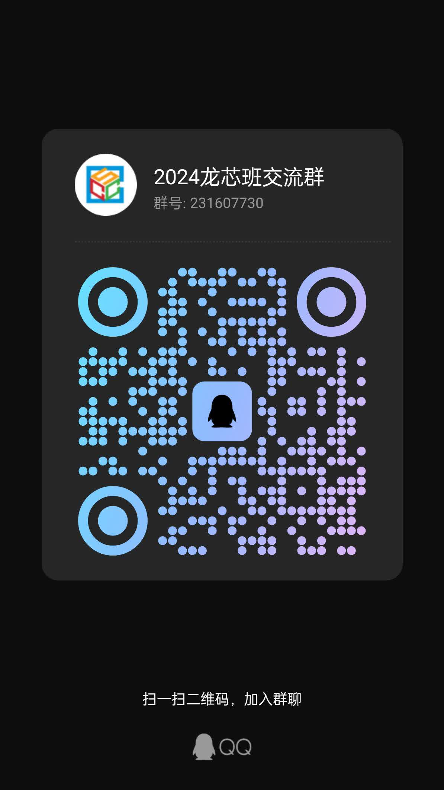

## 什么是 CPU？操作系统又是什么？

龙芯班是计工优秀科创团队之一，与龙芯中科联合达成合作，专注计算机底层。从 CPU 到操作系统，用 Verilog 书写属于自己的处理器，用 Rust/C 编写独属于自己的 OS。

## 来龙芯能学到什么

- CPU 设计方法：可独立设计一款五级流水线处理器（熟练可冲击六级流水线），掌握 CPU 基本设计思路，了解国内处理器企业，获得龙芯中科实习经历。

- OS 架构设计：用 Rust/C 编写属于自己的 OS，掌握操作系统架构，独立编写 OS 各项功能，学会上板烧录进行命令行互动，深入学习操作系统原理，汇编语言，裸机程序开发，编译原理和嵌入式开发。可以得到相关企业的参观和实习机会。

- 编译器设计：设计一款支持类 C 语言的编译器并进行性能优化，深入学习编译原理，指令优化以及编程语言设计。

## 能参加什么竞赛

龙芯班于每年暑假参加全国大学生计算机系统能力竞赛下属的龙芯杯与操作系统大赛（同属于为五星级竞赛🌟🌟🌟🌟🌟）。

比赛官网：[全国大学生计算机系统能力大赛](https://os.educg.net)

## 2024 年获奖经历

- 龙芯杯团队赛全国二等奖×2（团队各有大一成员一名）
- 操作系统全国三等奖（团队两位大一成员）

无论你以前是否有相关经验，或者你是否为计算机专业，龙芯班都欢迎您。

---
诚挚欢迎每一位对计算机底层感兴趣的同学，龙芯班欢迎各位到来，希望能与你共建东秦龙芯生态。

## FAQ

### 大一新生能来吗，会不会太早了

完全不会！不需要任何学校课程的要求，内容完全可以自学。大一新生也能学会并且学得很好！事实上，在目前的团队中，大部分都是大一刚入学时就加入的。

### 完全零基础可以吗

当然可以。但是零基础的同学学习的内容会相对多一些。我们建议你先锻炼自己的自学能力，熟练地掌握一名语言进行大型项目开发。当然，你不需要在这以后才加入我们。团队里经验丰富的学长们能为你提供指导和帮助，让你的学习过程更快更轻松

### 哪些人更适合加入

当然是什么都会的大佬，但是这显然是不可能的，至少我们目前还没有招到过。不过具有丰富的工程开发经验，底层开发能力，对操作系统有一点了解或使用过 Linux 作为主力机的人会更有优势一些。

### 实验室有专业限制吗

没有，本实验室面向全校学生开放。只要你写代码，就能加入我们。

## 快加入招新群

点击[此链接](https://qm.qq.com/q/aq8aBrqzwQ)，或扫码下面的二维码，立刻加入2024龙芯实验室交流群！

