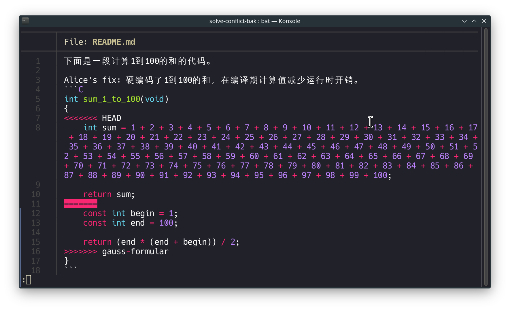

冲突是使用 Git 的过程中不可避免的问题。冲突的产生是因为两个人同时修改了同一个文件的同一部分。Git 无法判断哪个修改是正确的，因此需要人工介入。

## 冲突的产生和解决

冲突的产生是因为两个人同时修改了同一个文件的同一部分。例如，Alice 修改了文件的第一行，Bob 修改了文件的第一行。当 Alice 将修改推送到远程仓库时，Git 会提示 Bob 有冲突，Bob 需要解决冲突后再推送。

下面让我们来产生一个冲突。

请完整克隆这个仓库[这个仓库](https://github.com/NEUQ-CS/solve-conflict)的所有分支。你可以使用以下命令：

```bash
git clone https://github.com/NEUQ-CS/solve-conflict.git
```

进入仓库后，打开`README.md`查看，又是1加到100的作业。

```C
// 下面是一段计算1到100的和的代码。

int sum_1_to_100(void)
{
    int sum = 0;

    for (int i = 1; i <= 100; i++)
    {
        sum += i;
    }

    return sum;
}
```

你觉得这个代码太弱智了，于是你决定使用高斯公式来修改这份作业。

首先我们检出一个新的分支`gauss-formula`。

```bash
git checkout -b gauss-formula
```

但是先别立即开始修改代码，让我们模拟一下冲突的产生。

假设 Alice 也在修改这份作业，她有另一种方法来优化这段代码。现在假设你是 Alice，让我们先回到主分支。然后切换到`alice-fix`。输入`git log`查看一下提交记录。

发现 Alice 提交了一个修改，在编译期间计算出了1到100的和。现在让Alice把这个修改合并到主分支。

```bash
git checkout master
git merge alice-fix
```

好的，Alice 的角色扮演结束了，现在回到你的角色。

```bash
git checkout gauss-formula
```

然后修改代码：

```C
// 下面是一段计算1到100的和的代码。

int sum_1_to_100(void)
{
    const int begin = 1;
    const int end = 100;

    return (end * (end + begin)) / 2;
}
```

然后提交代码。

```bash
git add README.md
git commit -m "use gauss formula to calculate sum from 1 to 100"
```

现在尝试合并到主分支。

```bash
git checkout master
git merge gauss-formula
```

Boom! 冲突产生了。你应该会看到以下结果：
```ascii
caiyi@archlinux ~/r/solve-conflict-bak (master)> git merge gauss-formular 
Auto-merging README.md
CONFLICT (content): Merge conflict in README.md
Automatic merge failed; fix conflicts and then commit the result.
```

让我们用`git status`查看一下：
```ascii
caiyi@archlinux ~/r/solve-conflict-bak (master|MERGING)> git status
On branch master
You have unmerged paths.
  (fix conflicts and run "git commit")
  (use "git merge --abort" to abort the merge)

Unmerged paths:
  (use "git add <file>..." to mark resolution)
        both modified:   README.md

no changes added to commit (use "git add" and/or "git commit -a")
```

git 命令行提示，两者都修改了`README.md`。但是同时修改同一个文件并不一定意味着一定会有冲突。如果两者修改的部分不同，Git 会自动合并。但是如果两者修改的部分相同，就会产生冲突。

再次打开`README.md`，你会发现这个文件变成了你完全不认识的样子：



我这里不得不用图片，因为这些内容也会被当前的仓库当成冲突处理。

由一堆`<<<<<<<<`和一堆`>>>>>>>>`包裹的部分就是冲突的部分。`=======`后的部分是你的修改(后出现的修改)，`前面的是别人的修改(先出现的修改)。这些符合叫做合并冲突标记。

你需要手动解决冲突。解决冲突意味着你要删除合并冲突标记，并保留一个你认为正确的修改。

在你看来，硬编码了`int sum = 1 + 2 + 3 + 4 + 5 + 6 + 7 + 8 + 9 + 10 + 11 + 12 + 13 + 14 + 15 + 16 + 17 + 18 + 19 + 20 + 21 + 22 + 23 + 24 + 25 + 26 + 27 + 28 + 29 + 30 + 31 + 32 + 33 + 34 + 35 + 36 + 37 + 38 + 39 + 40 + 41 + 42 + 43 + 44 + 45 + 46 + 47 + 48 + 49 + 50 + 51 + 52 + 53 + 54 + 55 + 56 + 57 + 58 + 59 + 60 + 61 + 62 + 63 + 64 + 65 + 66 + 67 + 68 + 69 + 70 + 71 + 72 + 73 + 74 + 75 + 76 + 77 + 78 + 79 + 80 + 81 + 82 + 83 + 84 + 85 + 86 + 87 + 88 + 89 + 90 + 91 + 92 + 93 + 94 + 95 + 96 + 97 + 98 + 99 + 100;`显然是一个对可读性非常不友好的修改。因此你决定保留高斯公式的修改。

让我们删除冲突标记，alice 的代码以及上面那句话。修改完后保存文件。

这个文件现在应该看起来和你原来作出的修改一样。


然后将修改加入暂存区。

```bash
git add README.md
```

然后提交。解决完冲突并提交的时候不需要手动输入提交信息。因为你原本是想合并两个分支的修改，因此commit就是一个合并提交。我们可以直接输入
```bash
git commit
```

接下来你应该会来到一个编辑器界面，这个界面显示了合并提交的信息。这个信息包含了两个分支的提交信息，你可以保留这个信息，也可以修改这个信息。这个信息的格式是这样的：
```ascii
Merge branch 'gauss-formular'
```

下面还有一堆信息，不过它们都是注释，不会被提交。

保存并退出编辑器，然后你就完成了合并。

```ascii
[master fb2755b] Merge branch 'gauss-formular'
```

现在你可以推送到远程仓库了。
