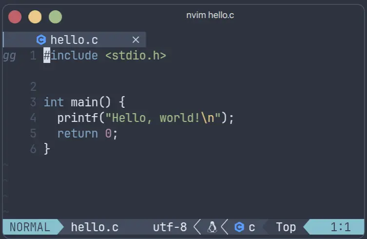

使用 Vim 最重要的还是实际操作，也许在小型简单项目全程使用 Vim 最为主要的编辑器是个不错的选择。VSCode、Jetbrains IDEs 都有 Vim-mode 插件，可以享受 Vim 带来的便捷。

## 学习方式

```bash {filename="Terminal"}
vimtutor
```

没想到吧，Vim 官方准备了一个学习工具。

## NeoVim

Neovim 是一款基于Vim的现代化文本编辑器。它是由 Bram Moolenaar 创建的 Vim 项目的重生版本，旨在解决 Vim 的维护和扩展的问题，[NeoVim 官方网站](https://neovim.io)给出了详细的文档。

NeoVim 丰富的扩展插件是一大吸引人的特色，打造高颜值 UI 不在话下。


