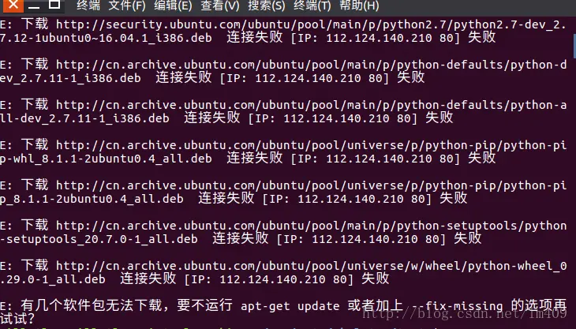

一天早上你一如既往地起床，启动了你昨晚熬夜安装完的 Ubuntu 24.04，你生疏地开始了命令行操作：

```bash {filename="Terminal"}
sudo apt update && sudo apt upgrade
```

也不知道是 GFW 还是 DNS 污染的缘故，`apt update` 失败了：



OMG！看来得换国内源了，用 Vim 修改一下 `/etc/apt/sources.list` ~~，是时候用这个借口来学习 Vim 了~~ 。
