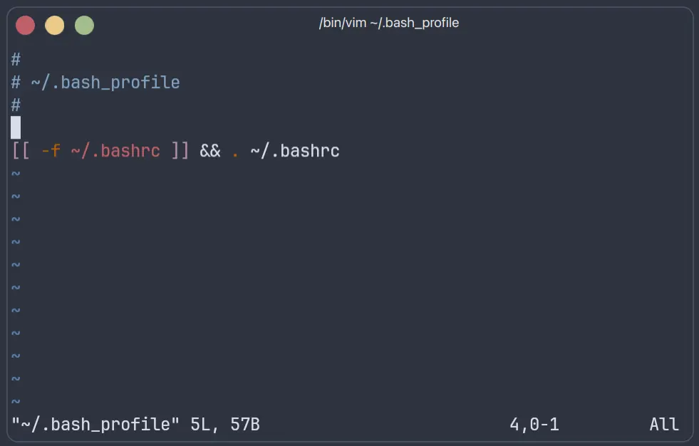

## 介绍

Vim 是一个非常强大且高度可定制的文本编辑器，在 Unix/Linux 系统中非常常见。它是基于 vi 编辑器的增强版，因此有时也称为 `Vi IMproved`。


对于刚接触 Vim 的同学，可能会反感 Vim 的操作，属于正常现象。


## 打开 Vim 编译器

在命令行中，输入

```bash {filename="Terminal"}
vim <file_name>
```

打开文本文件。



现在修改文件内容，按下键盘，却并没有出现对应的字符。

这个时候就要说明了，现在 Vim 正在处于命令模式，键盘上的绝大多数按键都是一个独立的命令。

## Vim 的模式

- 命令模式：初始模式，可以使用命令。


- 输入模式：按下 <kbd>i</kbd> / <kbd>a</kbd> / <kbd>o</kbd> 键进入，进行文本编辑。

- 底线命令模式：按下 <kbd>:</kbd> 进入 Vim 内部命令行。

- 可视模式： 按下 <kbd>v</kbd> 或 <kbd>V</kbd> 键进入，用于对文本块的复制/剪切等操作。


一下子看到 Vim 这么多键位，是不是有点被吓到？  
不过不用担心，只用记住几个关键操作，不清楚的操作我们可以通过 STFW 和 RTFM 获得，熟能生巧。

